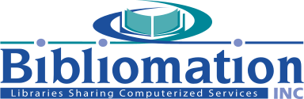

# Bibliomation Inc.

Connecticut’s largest library consortium and the state’s only open source consortium. We share an Evergreen ILS with member libraries and contribute tools and documentation for the wider open source community.

## Featured Content

- [Internship repository](https://github.com/Bibliomation-Inc/internship): Onboarding, guides, and examples for interns
- [Internship docs site](https://bibliomation-inc.github.io/internship)
- [LibraryIQ Extract](https://github.com/Bibliomation-Inc/library-iq-extract): Export Evergreen data for analytics

## What You'll Find

- Public documents for interns
- Tools, scripts, and utilities for Evergreen ILS
- Reusable workflows and small services supporting libraries

## Contributing

Open issues for ideas or bugs, and submit pull requests to improve docs and tools.

---

Learn more: [biblio.org](https://biblio.org)